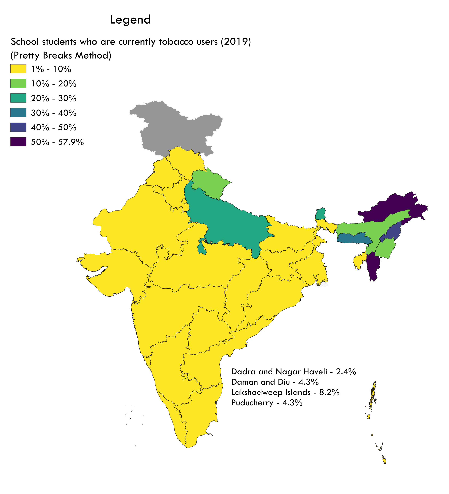
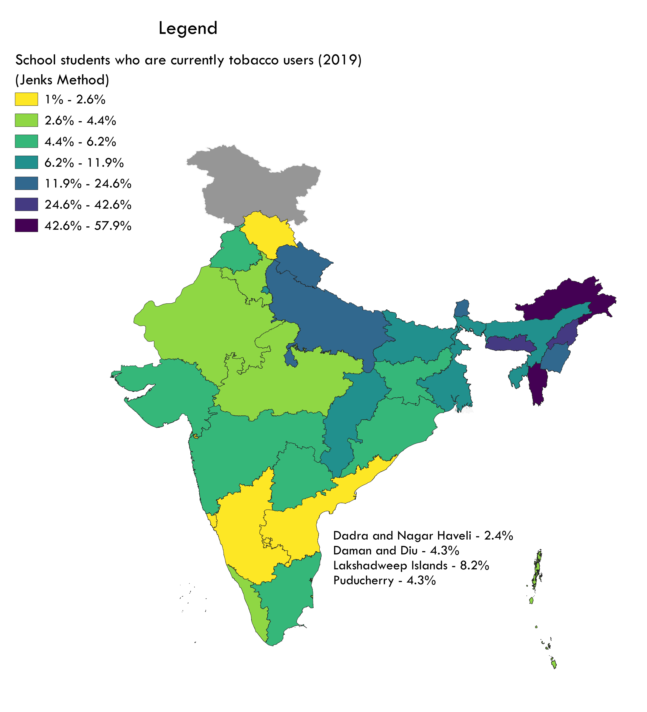

## Overview

This is a basic EDA on GYTS-4 dataset created by IIPS, Mumbai in 2019. The data covers the use of tobacco and its products by school-age students in India as well as sources of purchase for different tobacco products. The dataset also investigates schools' awareness of policies implemented by the government to reduce tobacco use among students.
```{r packages, include=FALSE}
library(tidyverse)
library(plotly)
library(readr)
library(rmarkdown)
```

### Table Preview for state-wise data
```{r importing_data, include=FALSE}
state_usage_total <- read_csv('./Sources/GYTS4_state_usage_total.csv')
```
```{r showing_table, echo=TRUE}
paged_table(state_usage_total)
```
## State-wise breakdown

Here are the top ten states when it comes tobacco usage among students:

```{r bar-graph, echo=TRUE}
top_ten <- state_usage_total %>% 
  filter(Area == 'Total') %>% 
  arrange(desc(`Current tobacco users`)) %>% 
  head(10)

top_ten_graph <- plot_ly(data = top_ten,
                         x = ~State,
                         y = ~`Current tobacco users`,
                         type = 'bar',
                         text = ~paste0(`Current tobacco users`, '%'),
                         textposition = 'outside',
                         width = 900,
                         height = 700) %>% 
  layout(title = 'Top ten states by tobacco usage among students',
         xaxis = list(categoryorder = 'total descending'),
         yaxis = list(title = 'Current tobacco users'))
top_ten_graph
```

Let's see the difference between urban and rural usage in all states:
```{r importing-pivoted-table, include=FALSE}
state_ur <- read.csv('./Sources/state_ur.csv')
```
```{r echo=TRUE}
paged_table(state_ur)
```
```{r grouped-bar-graph, echo=TRUE}
state_ur_graph <- plot_ly(data = state_ur,
                          x = ~State,
                          y = ~Urban, name = 'Urban',
                          type = 'bar',
                          text = ~paste0(Urban, '%'),
                          textposition = 'none',
                          width = 900,
                          height = 700) %>% 
  add_trace(y = ~Rural, name = 'Rural',
            text = ~paste0(Rural, '%'),
            textposition = 'none') %>% 
  layout(title = 'Tobacco users by area',
         xaxis = list(title = 'States', categoryorder = 'total descending'),
         yaxis = list(title = '% of tobacco users in area'))
state_ur_graph
```

## Let's talk about e-cigarettes!
Also known as electronic cigarettes, they can potentially help people addicted to smoked tobacco products such as cigarettes. But how commonly are they used in India? Are students aware of them?

```{r importing-ecig-table, include=FALSE}
state_ecig <- read.csv('./Sources/state_ecig.csv')
```
```{r}
paged_table(state_ecig)
```
Let's see if there is any pattern to be found between awareness of e-cigarettes and their usage.
```{r ecigaware}
state_ecig_graph <- plot_ly(state_ecig,
                            x = ~ecig_aware,
                            y = ~ever_ecig_use,
                            type = 'scatter',
                            mode = 'markers',
                            color = ~Area,
                            colors = 'viridis',
                            text = ~paste0(ecig_aware, '%', ', ', ever_ecig_use, '%', ' in ', Area, ' ', State),
                            textposition = 'none',
                            width = 900,
                            height = 700) %>% 
  layout(title = 'Awareness vs Usage',
         xaxis = list(title = 'Awareness about e-cigarette'),
         yaxis = list(title = 'Ever e-cigarette used'))
state_ecig_graph
```

```{r ecigtob}
state_ecig_graph <- plot_ly(state_ecig,
                            x = ~curr_tob_user,
                            y = ~ever_ecig_use,
                            type = 'scatter',
                            mode = 'markers',
                            color = ~Area,
                            colors = 'viridis',
                            text = ~paste0(ecig_aware, '%', ', ', ever_ecig_use, '%', ' in ', Area, ' ', State),
                            textposition = 'none',
                            width = 900,
                            height = 700) %>% 
  layout(title = 'Tobacco usage vs E-cigarette usage',
         xaxis = list(title = 'Current tobacco user'),
         yaxis = list(title = 'Ever e-cigarette used'))
state_ecig_graph
```

There is a stronger correlation between tobacco users and e-cigarette use, indicating that the population of students is using e-cigarettes increases with increase in tobacco use.

## Maps
To top it all off, let's look at some maps I made through QGIS as R and shapefiles don't exactly mix well. 
```{r echo=FALSE}


```
That's all, folks.