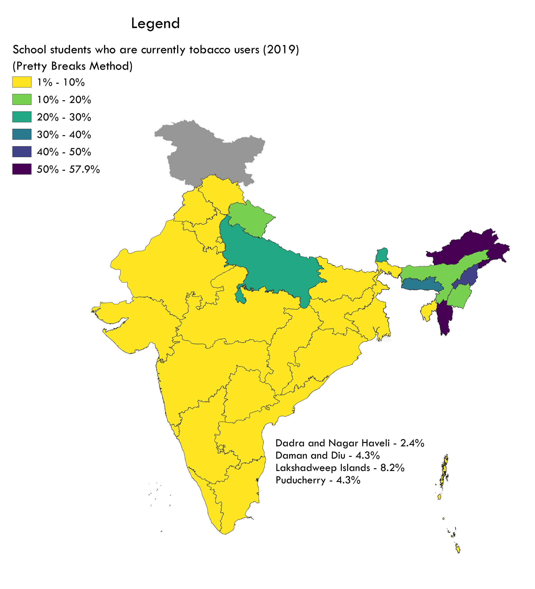

Tobacco Case Study
================
Tanmoy Sahoo
2023-07-11

## Overview

This is a basic EDA on GYTS-4 dataset created by IIPS, Mumbai in 2019.
The data covers the use of tobacco and its products by school-age
students in India as well as sources of purchase for different tobacco
products. The dataset also investigates schools’ awareness of policies
implemented by the government to reduce tobacco use among students.

### Table Preview for state-wise data

``` r
paged_table(state_usage_total)
```

<div data-pagedtable="false">

<script data-pagedtable-source type="application/json">
{"columns":[{"label":["State"],"name":[1],"type":["chr"],"align":["left"]},{"label":["Area"],"name":[2],"type":["chr"],"align":["left"]},{"label":["Current tobacco users"],"name":[3],"type":["dbl"],"align":["right"]},{"label":["Current tobacco smokers"],"name":[4],"type":["dbl"],"align":["right"]},{"label":["Current cigarette users"],"name":[5],"type":["dbl"],"align":["right"]},{"label":["Current bidi users"],"name":[6],"type":["dbl"],"align":["right"]},{"label":["Awareness about e-cigarette"],"name":[7],"type":["dbl"],"align":["right"]},{"label":["Ever e-cigarette use"],"name":[8],"type":["dbl"],"align":["right"]},{"label":["Ever tobacco smokers who quit in last 12 months"],"name":[9],"type":["dbl"],"align":["right"]},{"label":["Current tobacco smokers who wanted to quit smoking now"],"name":[10],"type":["dbl"],"align":["right"]},{"label":["Current smokeless tobacco users who wanted to quit tobacco now"],"name":[11],"type":["dbl"],"align":["right"]},{"label":["Exposure to tobacco smoke at home/public place"],"name":[12],"type":["dbl"],"align":["right"]},{"label":["Exposure to tobacco smoke at home"],"name":[13],"type":["dbl"],"align":["right"]},{"label":["Exposure to tobacco smoke inside any enclosed public places"],"name":[14],"type":["dbl"],"align":["right"]},{"label":["Exposure to tobacco smoke at any outdoor public places"],"name":[15],"type":["dbl"],"align":["right"]},{"label":["Students who favoured ban inside enclosed public places"],"name":[16],"type":["dbl"],"align":["right"]},{"label":["Students who favoured ban at outdoor public places"],"name":[17],"type":["dbl"],"align":["right"]}],"data":[{"1":"Andaman and Nicobar Islands","2":"Total","3":"4.4","4":"3.7","5":"1.3","6":"1.0","7":"13.6","8":"1.6","9":"19.8","10":"30.9","11":"11.1","12":"35.6","13":"7.0","14":"26.9","15":"26.9","16":"65.0","17":"60.6"},{"1":"Andaman and Nicobar Islands","2":"Urban","3":"3.4","4":"2.6","5":"1.3","6":"0.7","7":"10.0","8":"1.1","9":"10.7","10":"24.2","11":"5.0","12":"36.2","13":"5.1","14":"25.2","15":"28.6","16":"65.1","17":"60.9"},{"1":"Andaman and Nicobar Islands","2":"Rural","3":"5.1","4":"4.4","5":"1.4","6":"1.3","7":"15.8","8":"2.0","9":"23.5","10":"33.5","11":"14.7","12":"35.2","13":"8.3","14":"27.9","15":"25.8","16":"65.0","17":"60.4"},{"1":"Andhra Pradesh","2":"Total","3":"2.6","4":"1.8","5":"1.1","6":"0.8","7":"16.5","8":"0.7","9":"12.8","10":"30.4","11":"36.5","12":"31.8","13":"7.2","14":"22.5","15":"25.0","16":"50.2","17":"50.8"},{"1":"Andhra Pradesh","2":"Urban","3":"0.7","4":"0.7","5":"0.4","6":"0.3","7":"17.7","8":"0.4","9":"7.4","10":"59.9","11":"85.9","12":"26.0","13":"3.6","14":"18.1","15":"20.2","16":"64.1","17":"62.4"},{"1":"Andhra Pradesh","2":"Rural","3":"3.5","4":"2.4","5":"1.4","6":"1.0","7":"15.9","8":"0.9","9":"13.9","10":"26.0","11":"35.8","12":"34.9","13":"9.1","14":"24.8","15":"27.5","16":"42.9","17":"44.7"},{"1":"Arunachal Pradesh","2":"Total","3":"57.9","4":"53.5","5":"45.9","6":"45.9","7":"25.9","8":"16.6","9":"22.6","10":"23.8","11":"16.8","12":"69.7","13":"31.4","14":"67.9","15":"64.1","16":"67.6","17":"69.6"},{"1":"Arunachal Pradesh","2":"Urban","3":"51.4","4":"50.0","5":"47.8","6":"47.4","7":"24.1","8":"18.6","9":"15.3","10":"13.7","11":"11.8","12":"68.6","13":"20.8","14":"67.9","15":"61.0","16":"79.4","17":"76.5"},{"1":"Arunachal Pradesh","2":"Rural","3":"69.2","4":"59.6","5":"42.8","6":"43.3","7":"29.0","8":"13.2","9":"32.7","10":"38.3","11":"31.4","12":"71.6","13":"49.5","14":"68.0","15":"69.5","16":"47.4","17":"57.9"},{"1":"Assam","2":"Total","3":"11.9","4":"10.5","5":"4.3","6":"2.9","7":"28.6","8":"4.2","9":"11.6","10":"22.9","11":"17.5","12":"26.0","13":"6.7","14":"19.1","15":"22.1","16":"53.7","17":"52.6"},{"1":"Assam","2":"Urban","3":"5.3","4":"5.3","5":"4.6","6":"1.1","7":"15.2","8":"0.9","9":"24.9","10":"50.2","11":"80.0","12":"38.0","13":"10.4","14":"33.3","15":"33.5","16":"68.7","17":"64.4"},{"1":"Assam","2":"Rural","3":"12.5","4":"10.9","5":"4.3","6":"3.1","7":"29.7","8":"4.5","9":"10.8","10":"21.7","11":"14.4","12":"25.0","13":"6.4","14":"17.9","15":"21.2","16":"52.4","17":"51.5"},{"1":"Bihar","2":"Total","3":"7.3","4":"4.7","5":"2.3","6":"1.8","7":"39.3","8":"2.0","9":"5.1","10":"28.9","11":"17.2","12":"18.4","13":"5.4","14":"14.3","15":"11.9","16":"52.2","17":"55.5"},{"1":"Bihar","2":"Urban","3":"7.0","4":"6.9","5":"4.4","6":"5.0","7":"34.8","8":"3.5","9":"18.9","10":"30.0","11":"0.0","12":"37.9","13":"3.0","14":"31.8","15":"34.2","16":"81.5","17":"85.5"},{"1":"Bihar","2":"Rural","3":"7.3","4":"4.6","5":"2.1","6":"1.6","7":"39.6","8":"1.9","9":"4.2","10":"28.8","11":"17.3","12":"17.3","13":"5.6","14":"13.3","15":"10.6","16":"50.4","17":"53.7"},{"1":"Chandigarh","2":"Total","3":"3.0","4":"2.5","5":"0.6","6":"0.6","7":"24.8","8":"2.5","9":"10.4","10":"13.4","11":"14.1","12":"28.2","13":"4.6","14":"15.8","15":"22.6","16":"71.4","17":"70.4"},{"1":"Chandigarh","2":"Urban","3":"3.0","4":"2.5","5":"0.5","6":"0.7","7":"25.4","8":"2.4","9":"7.7","10":"14.0","11":"13.8","12":"29.1","13":"4.8","14":"16.3","15":"23.3","16":"73.8","17":"72.5"},{"1":"Chandigarh","2":"Rural","3":"3.2","4":"3.2","5":"1.6","6":"0.1","7":"11.6","8":"4.6","9":"94.0","10":"3.2","11":"100.0","12":"9.2","13":"1.8","14":"5.9","15":"6.2","16":"20.4","17":"26.6"},{"1":"Chhattisgarh","2":"Total","3":"8.0","4":"6.9","5":"4.5","6":"2.2","7":"20.6","8":"2.1","9":"18.5","10":"29.0","11":"21.3","12":"36.8","13":"16.8","14":"25.6","15":"24.2","16":"63.8","17":"69.1"},{"1":"Chhattisgarh","2":"Urban","3":"7.5","4":"7.3","5":"3.7","6":"2.0","7":"28.8","8":"2.4","9":"9.8","10":"22.1","11":"56.3","12":"26.7","13":"3.1","14":"21.0","15":"20.0","16":"70.7","17":"74.4"},{"1":"Chhattisgarh","2":"Rural","3":"8.1","4":"6.8","5":"4.7","6":"2.2","7":"18.7","8":"2.0","9":"21.5","10":"30.7","11":"17.2","12":"39.1","13":"19.9","14":"26.6","15":"25.2","16":"62.2","17":"67.8"},{"1":"Dadra and Nagar Haweli","2":"Total","3":"2.4","4":"2.2","5":"1.1","6":"1.3","7":"17.2","8":"1.2","9":"22.3","10":"52.1","11":"65.2","12":"38.0","13":"6.5","14":"21.6","15":"30.8","16":"56.1","17":"55.9"},{"1":"Dadra and Nagar Haweli","2":"Urban","3":"2.1","4":"2.1","5":"1.2","6":"1.2","7":"15.5","8":"0.5","9":"4.1","10":"20.5","11":"87.1","12":"22.1","13":"3.3","14":"11.8","15":"20.2","16":"62.6","17":"62.3"},{"1":"Dadra and Nagar Haweli","2":"Rural","3":"2.5","4":"2.2","5":"1.1","6":"1.4","7":"18.1","8":"1.6","9":"31.4","10":"65.9","11":"60.6","12":"45.5","13":"8.0","14":"26.3","15":"35.9","16":"53.0","17":"52.9"},{"1":"Daman and Diu","2":"Total","3":"4.3","4":"3.4","5":"2.2","6":"2.1","7":"26.2","8":"1.5","9":"9.7","10":"29.7","11":"49.4","12":"28.2","13":"4.8","14":"19.1","15":"22.0","16":"66.6","17":"63.7"},{"1":"Daman and Diu","2":"Urban","3":"1.9","4":"1.1","5":"0.5","6":"0.9","7":"25.0","8":"0.7","9":"7.6","10":"40.0","11":"27.7","12":"26.1","13":"2.4","14":"16.4","15":"20.9","16":"70.8","17":"68.6"},{"1":"Daman and Diu","2":"Rural","3":"5.5","4":"4.5","5":"3.0","6":"2.7","7":"26.8","8":"1.9","9":"10.3","10":"28.5","11":"54.8","12":"29.2","13":"6.0","14":"20.4","15":"22.5","16":"64.6","17":"61.4"},{"1":"Delhi","2":"Total","3":"8.0","4":"7.5","5":"2.7","6":"2.5","7":"40.6","8":"11.1","9":"4.0","10":"11.4","11":"8.9","12":"37.8","13":"4.6","14":"31.6","15":"32.5","16":"61.5","17":"63.5"},{"1":"Delhi","2":"Urban","3":"8.1","4":"7.7","5":"2.8","6":"2.5","7":"41.1","8":"11.4","9":"3.8","10":"11.2","11":"9.7","12":"38.0","13":"4.5","14":"32.1","15":"32.7","16":"60.6","17":"62.7"},{"1":"Delhi","2":"Rural","3":"5.7","4":"2.4","5":"0.5","6":"0.7","7":"28.1","8":"2.9","9":"20.6","10":"26.7","11":"2.9","12":"31.0","13":"7.5","14":"19.8","15":"27.1","16":"85.7","17":"85.7"},{"1":"Goa","2":"Total","3":"2.1","4":"1.4","5":"0.7","6":"0.8","7":"22.0","8":"0.7","9":"7.7","10":"26.4","11":"31.0","12":"28.4","13":"2.8","14":"17.0","15":"23.0","16":"74.9","17":"72.1"},{"1":"Goa","2":"Urban","3":"1.9","4":"1.2","5":"0.6","6":"0.8","7":"23.3","8":"0.9","9":"11.4","10":"43.2","11":"46.4","12":"24.1","13":"1.8","14":"13.7","15":"19.8","16":"76.1","17":"75.3"},{"1":"Goa","2":"Rural","3":"2.2","4":"1.5","5":"0.8","6":"0.8","7":"21.2","8":"0.5","9":"6.2","10":"17.2","11":"24.3","12":"31.2","13":"3.4","14":"19.1","15":"25.1","16":"74.1","17":"70.1"},{"1":"Gujarat","2":"Total","3":"5.4","4":"5.1","5":"3.3","6":"3.3","7":"21.6","8":"2.0","9":"25.8","10":"57.1","11":"64.9","12":"29.8","13":"10.3","14":"20.6","15":"22.2","16":"60.7","17":"59.1"},{"1":"Gujarat","2":"Urban","3":"3.3","4":"2.7","5":"1.5","6":"1.3","7":"25.3","8":"0.9","9":"31.7","10":"51.3","11":"71.2","12":"30.2","13":"7.0","14":"21.3","15":"23.7","16":"67.3","17":"65.0"},{"1":"Gujarat","2":"Rural","3":"6.1","4":"5.9","5":"4.0","6":"3.9","7":"20.3","8":"2.4","9":"24.5","10":"58.0","11":"64.0","12":"29.6","13":"11.5","14":"20.3","15":"21.7","16":"58.5","17":"57.1"},{"1":"Haryana","2":"Total","3":"3.8","4":"2.7","5":"0.8","6":"0.7","7":"31.0","8":"2.2","9":"4.1","10":"19.2","11":"7.5","12":"23.7","13":"8.5","14":"14.4","15":"16.5","16":"63.4","17":"67.2"},{"1":"Haryana","2":"Urban","3":"5.6","4":"4.3","5":"1.3","6":"1.0","7":"31.1","8":"4.0","9":"3.0","10":"14.6","11":"7.4","12":"25.5","13":"6.9","14":"17.0","15":"19.3","16":"62.4","17":"64.2"},{"1":"Haryana","2":"Rural","3":"2.6","4":"1.7","5":"0.5","6":"0.5","7":"30.9","8":"1.0","9":"5.6","10":"27.1","11":"7.8","12":"22.6","13":"9.5","14":"12.6","15":"14.6","16":"64.0","17":"69.2"},{"1":"Himachal Pradesh","2":"Total","3":"1.0","4":"0.5","5":"0.1","6":"0.1","7":"15.1","8":"0.4","9":"1.1","10":"11.6","11":"0.0","12":"13.4","13":"4.5","14":"7.6","15":"9.1","16":"52.6","17":"55.8"},{"1":"Himachal Pradesh","2":"Urban","3":"1.4","4":"0.3","5":"0.3","6":"0.3","7":"27.2","8":"0.6","9":"0.5","10":"2.1","11":"0.0","12":"26.2","13":"8.1","14":"14.4","15":"18.1","16":"68.8","17":"69.5"},{"1":"Himachal Pradesh","2":"Rural","3":"1.0","4":"0.5","5":"0.1","6":"0.1","7":"13.5","8":"0.3","9":"1.1","10":"12.3","11":"0.0","12":"11.7","13":"4.0","14":"6.7","15":"7.9","16":"50.4","17":"54.0"},{"1":"Jharkhand","2":"Total","3":"5.1","4":"3.6","5":"1.1","6":"1.7","7":"31.4","8":"3.6","9":"11.1","10":"21.7","11":"20.5","12":"23.2","13":"6.8","14":"17.5","15":"19.7","16":"49.4","17":"52.3"},{"1":"Jharkhand","2":"Urban","3":"2.4","4":"2.1","5":"0.8","6":"1.1","7":"30.9","8":"2.6","9":"10.1","10":"41.0","11":"8.3","12":"31.1","13":"3.1","14":"18.5","15":"26.8","16":"81.5","17":"81.6"},{"1":"Jharkhand","2":"Rural","3":"5.6","4":"3.9","5":"1.1","6":"1.8","7":"31.5","8":"3.7","9":"11.2","10":"19.9","11":"20.9","12":"21.8","13":"7.4","14":"17.3","15":"18.5","16":"44.0","17":"47.3"},{"1":"Karnataka","2":"Total","3":"1.2","4":"0.5","5":"0.5","6":"0.5","7":"21.4","8":"0.0","9":"0.0","10":"99.9","11":"100.0","12":"28.7","13":"6.7","14":"16.4","15":"25.7","16":"69.4","17":"69.1"},{"1":"Karnataka","2":"Urban","3":"0.0","4":"0.0","5":"0.0","6":"0.0","7":"0.4","8":"0.0","9":"0.0","10":"0.8","11":"51.9","12":"0.9","13":"0.2","14":"0.7","15":"0.7","16":"99.2","17":"99.2"},{"1":"Karnataka","2":"Rural","3":"1.2","4":"0.5","5":"0.5","6":"0.5","7":"21.4","8":"0.0","9":"0.0","10":"100.0","11":"100.0","12":"28.8","13":"6.7","14":"16.5","15":"25.8","16":"69.3","17":"69.0"},{"1":"Kerala","2":"Total","3":"3.2","4":"2.4","5":"2.0","6":"0.9","7":"41.0","8":"2.1","9":"24.4","10":"38.9","11":"36.7","12":"34.2","13":"8.6","14":"20.7","15":"26.7","16":"86.2","17":"84.8"},{"1":"Kerala","2":"Urban","3":"1.7","4":"1.0","5":"0.9","6":"0.1","7":"38.7","8":"1.9","9":"24.3","10":"9.4","11":"40.3","12":"28.3","13":"8.4","14":"15.4","15":"22.8","16":"82.7","17":"83.4"},{"1":"Kerala","2":"Rural","3":"3.5","4":"2.7","5":"2.2","6":"1.1","7":"41.4","8":"2.2","9":"24.4","10":"40.9","11":"35.8","12":"35.3","13":"8.7","14":"21.6","15":"27.5","16":"86.9","17":"85.1"},{"1":"Lakshadweep","2":"Total","3":"8.1","4":"6.6","5":"4.0","6":"2.9","7":"37.9","8":"2.9","9":"35.2","10":"36.1","11":"30.9","12":"43.1","13":"21.0","14":"24.9","15":"32.5","16":"70.2","17":"70.4"},{"1":"Lakshadweep","2":"Urban","3":"6.1","4":"3.7","5":"2.6","6":"2.7","7":"31.7","8":"0.3","9":"23.0","10":"54.4","11":"43.0","12":"55.2","13":"27.7","14":"23.3","15":"38.5","16":"73.2","17":"74.9"},{"1":"Lakshadweep","2":"Rural","3":"8.6","4":"7.3","5":"4.4","6":"2.9","7":"39.5","8":"3.5","9":"36.7","10":"33.7","11":"27.5","12":"40.0","13":"19.3","14":"25.4","15":"31.0","16":"69.4","17":"69.2"},{"1":"Madhya Pradesh","2":"Total","3":"3.9","4":"3.7","5":"2.2","6":"1.6","7":"26.4","8":"2.7","9":"8.9","10":"37.9","11":"30.9","12":"23.8","13":"11.0","14":"17.5","15":"18.4","16":"52.2","17":"55.4"},{"1":"Madhya Pradesh","2":"Urban","3":"3.3","4":"2.6","5":"0.4","6":"0.4","7":"23.5","8":"2.0","9":"14.8","10":"6.2","11":"17.3","12":"22.6","13":"8.7","14":"13.4","15":"17.9","16":"60.5","17":"62.4"},{"1":"Madhya Pradesh","2":"Rural","3":"4.0","4":"3.9","5":"2.5","6":"1.8","7":"26.8","8":"2.8","9":"8.1","10":"40.9","11":"32.9","12":"23.9","13":"11.3","14":"18.1","15":"18.4","16":"51.0","17":"54.4"},{"1":"Maharashtra","2":"Total","3":"5.1","4":"4.0","5":"1.4","6":"1.6","7":"25.5","8":"2.8","9":"12.6","10":"24.3","11":"15.7","12":"31.5","13":"7.8","14":"22.2","15":"23.7","16":"60.6","17":"60.8"},{"1":"Maharashtra","2":"Urban","3":"5.7","4":"4.3","5":"1.9","6":"2.2","7":"25.6","8":"3.0","9":"16.4","10":"35.5","11":"17.8","12":"34.7","13":"7.7","14":"24.9","15":"27.1","16":"62.2","17":"65.7"},{"1":"Maharashtra","2":"Rural","3":"4.6","4":"3.6","5":"0.9","6":"0.9","7":"25.4","8":"2.5","9":"8.4","10":"10.9","11":"11.7","12":"28.1","13":"8.0","14":"19.4","15":"20.1","16":"59.0","17":"55.8"},{"1":"Manipur","2":"Total","3":"19.5","4":"13.4","5":"7.3","6":"7.3","7":"10.2","8":"1.9","9":"22.3","10":"50.3","11":"43.8","12":"51.6","13":"22.5","14":"41.7","15":"41.7","16":"69.9","17":"72.4"},{"1":"Manipur","2":"Urban","3":"16.8","4":"11.0","5":"10.6","6":"1.4","7":"14.9","8":"3.3","9":"32.8","10":"64.8","11":"56.8","12":"47.7","13":"20.0","14":"36.2","15":"38.8","16":"61.1","17":"60.0"},{"1":"Manipur","2":"Rural","3":"20.5","4":"14.3","5":"5.9","6":"9.7","7":"8.4","8":"1.3","9":"17.8","10":"45.8","11":"40.3","12":"53.1","13":"23.5","14":"43.9","15":"42.8","16":"73.5","17":"77.4"},{"1":"Meghalaya","2":"Total","3":"33.6","4":"27.1","5":"19.2","6":"15.1","7":"36.9","8":"11.1","9":"35.5","10":"59.6","11":"66.8","12":"69.5","13":"38.5","14":"55.1","15":"61.3","16":"70.7","17":"78.7"},{"1":"Meghalaya","2":"Urban","3":"35.1","4":"20.8","5":"16.9","6":"6.7","7":"47.3","8":"14.8","9":"40.7","10":"67.9","11":"60.5","12":"74.4","13":"30.8","14":"56.3","15":"67.3","16":"83.1","17":"84.3"},{"1":"Meghalaya","2":"Rural","3":"33.2","4":"29.0","5":"19.9","6":"17.5","7":"33.9","8":"10.0","9":"33.9","10":"57.9","11":"68.7","12":"68.0","13":"40.8","14":"54.7","15":"59.5","16":"67.1","17":"77.0"},{"1":"Mizoram","2":"Total","3":"57.9","4":"43.6","5":"35.3","6":"4.6","7":"37.9","8":"21.1","9":"21.8","10":"52.7","11":"50.2","12":"64.8","13":"42.4","14":"50.7","15":"55.8","16":"85.9","17":"88.6"},{"1":"Mizoram","2":"Urban","3":"59.6","4":"44.5","5":"37.3","6":"4.7","7":"37.7","8":"18.5","9":"21.3","10":"54.9","11":"54.5","12":"65.7","13":"43.3","14":"53.5","15":"57.0","16":"86.6","17":"92.1"},{"1":"Mizoram","2":"Rural","3":"55.8","4":"42.4","5":"32.7","6":"4.3","7":"38.2","8":"24.4","9":"22.4","10":"49.5","11":"42.6","12":"63.6","13":"41.3","14":"46.9","15":"54.1","16":"85.1","17":"83.9"},{"1":"Nagaland","2":"Total","3":"42.6","4":"26.5","5":"20.4","6":"20.8","7":"17.3","8":"2.9","9":"13.5","10":"78.6","11":"85.1","12":"68.7","13":"28.3","14":"57.9","15":"54.4","16":"80.4","17":"61.5"},{"1":"Nagaland","2":"Urban","3":"37.4","4":"22.5","5":"16.4","6":"15.1","7":"19.5","8":"3.4","9":"19.5","10":"72.3","11":"77.7","12":"62.5","13":"25.0","14":"53.4","15":"49.5","16":"82.4","17":"69.1"},{"1":"Nagaland","2":"Rural","3":"46.8","4":"29.7","5":"23.6","6":"25.3","7":"15.5","8":"2.6","9":"9.4","10":"82.5","11":"89.8","12":"73.7","13":"31.1","14":"61.6","15":"58.4","16":"78.8","17":"55.4"},{"1":"Odisha","2":"Total","3":"6.2","4":"4.6","5":"1.6","6":"1.9","7":"9.6","8":"2.0","9":"11.6","10":"20.4","11":"17.3","12":"19.0","13":"5.0","14":"12.8","15":"13.6","16":"46.3","17":"42.6"},{"1":"Odisha","2":"Urban","3":"5.3","4":"3.8","5":"1.8","6":"0.7","7":"10.7","8":"2.3","9":"5.7","10":"11.3","11":"0.0","12":"16.9","13":"4.2","14":"10.6","15":"10.8","16":"51.8","17":"50.1"},{"1":"Odisha","2":"Rural","3":"6.4","4":"4.8","5":"1.5","6":"2.1","7":"9.4","8":"1.9","9":"12.3","10":"21.7","11":"20.1","12":"19.4","13":"5.2","14":"13.2","15":"14.1","16":"45.3","17":"41.3"},{"1":"Puducherry","2":"Total","3":"4.3","4":"2.8","5":"0.0","6":"0.0","7":"12.5","8":"0.2","9":"24.8","10":"0.1","11":"0.1","12":"49.2","13":"3.0","14":"42.0","15":"37.8","16":"52.6","17":"59.1"},{"1":"Puducherry","2":"Urban","3":"4.3","4":"2.8","5":"0.0","6":"0.0","7":"12.5","8":"0.2","9":"24.9","10":"0.0","11":"0.0","12":"49.3","13":"3.0","14":"42.0","15":"37.9","16":"52.5","17":"59.1"},{"1":"Puducherry","2":"Rural","3":"2.7","4":"1.7","5":"1.0","6":"0.6","7":"11.9","8":"1.4","9":"8.8","10":"36.7","11":"26.8","12":"29.6","13":"7.8","14":"22.4","15":"24.1","16":"78.5","17":"60.5"},{"1":"Punjab","2":"Total","3":"5.7","4":"5.3","5":"3.6","6":"2.9","7":"21.6","8":"2.1","9":"4.6","10":"36.8","11":"21.4","12":"15.2","13":"4.8","14":"10.4","15":"10.7","16":"46.9","17":"70.9"},{"1":"Punjab","2":"Urban","3":"3.0","4":"2.2","5":"0.8","6":"0.7","7":"20.4","8":"1.3","9":"3.1","10":"6.6","11":"0.0","12":"19.7","13":"2.8","14":"15.3","15":"16.5","16":"57.9","17":"81.2"},{"1":"Punjab","2":"Rural","3":"6.8","4":"6.6","5":"4.7","6":"3.9","7":"22.1","8":"2.4","9":"5.0","10":"41.1","11":"26.6","12":"13.3","13":"5.6","14":"8.3","15":"8.3","16":"42.3","17":"66.7"},{"1":"Rajasthan","2":"Total","3":"4.1","4":"3.9","5":"3.7","6":"3.6","7":"15.6","8":"0.4","9":"30.4","10":"88.9","11":"2.4","12":"19.2","13":"9.3","14":"12.7","15":"15.7","16":"69.2","17":"71.9"},{"1":"Rajasthan","2":"Urban","3":"0.7","4":"0.7","5":"0.7","6":"0.4","7":"23.0","8":"0.3","9":"0.0","10":"0.0","11":"100.0","12":"22.8","13":"10.1","14":"13.7","15":"15.3","16":"83.6","17":"83.2"},{"1":"Rajasthan","2":"Rural","3":"4.7","4":"4.5","5":"4.2","6":"4.1","7":"14.4","8":"0.4","9":"31.8","10":"91.4","11":"1.8","12":"18.5","13":"9.2","14":"12.5","15":"15.8","16":"66.7","17":"69.9"},{"1":"Sikkim","2":"Total","3":"24.6","4":"23.4","5":"19.4","6":"9.9","7":"50.0","8":"14.1","9":"37.2","10":"49.1","11":"55.2","12":"51.7","13":"19.0","14":"37.3","15":"41.8","16":"71.7","17":"69.6"},{"1":"Sikkim","2":"Urban","3":"26.7","4":"25.5","5":"21.3","6":"9.8","7":"57.5","8":"16.4","9":"40.1","10":"54.0","11":"49.7","12":"51.7","13":"18.4","14":"35.9","15":"40.5","16":"75.4","17":"73.4"},{"1":"Sikkim","2":"Rural","3":"21.4","4":"20.1","5":"16.5","6":"10.0","7":"38.9","8":"10.6","9":"31.4","10":"39.3","11":"69.3","12":"51.6","13":"19.9","14":"39.5","15":"43.7","16":"66.0","17":"63.7"},{"1":"Tamil Nadu","2":"Total","3":"4.8","4":"4.1","5":"2.3","6":"1.7","7":"11.1","8":"2.1","9":"16.4","10":"20.1","11":"16.5","12":"43.5","13":"14.5","14":"32.1","15":"34.6","16":"61.1","17":"62.2"},{"1":"Tamil Nadu","2":"Urban","3":"6.4","4":"5.8","5":"3.7","6":"2.1","7":"13.4","8":"2.5","9":"17.8","10":"22.7","11":"20.7","12":"41.9","13":"15.5","14":"31.2","15":"33.1","16":"66.1","17":"69.7"},{"1":"Tamil Nadu","2":"Rural","3":"3.4","4":"2.6","5":"1.1","6":"1.3","7":"9.1","8":"1.7","9":"14.3","10":"15.0","11":"11.1","12":"44.9","13":"13.6","14":"33.0","15":"35.9","16":"56.6","17":"55.6"},{"1":"Telangana","2":"Total","3":"5.2","4":"4.0","5":"2.5","6":"1.1","7":"25.3","8":"1.5","9":"15.7","10":"30.1","11":"48.9","12":"42.1","13":"11.4","14":"30.9","15":"32.3","16":"67.2","17":"65.8"},{"1":"Telangana","2":"Urban","3":"5.0","4":"3.8","5":"2.1","6":"1.0","7":"28.8","8":"1.5","9":"11.2","10":"20.0","11":"18.5","12":"42.0","13":"7.4","14":"31.8","15":"31.5","16":"72.5","17":"71.7"},{"1":"Telangana","2":"Rural","3":"5.5","4":"4.3","5":"3.1","6":"1.2","7":"20.8","8":"1.3","9":"21.3","10":"41.4","11":"85.0","12":"42.3","13":"16.4","14":"29.8","15":"33.4","16":"60.4","17":"58.4"},{"1":"Tripura","2":"Total","3":"7.6","4":"4.0","5":"2.7","6":"1.9","7":"38.0","8":"2.7","9":"12.7","10":"40.2","11":"22.5","12":"43.7","13":"17.0","14":"30.8","15":"35.8","16":"44.2","17":"43.5"},{"1":"Tripura","2":"Urban","3":"2.4","4":"2.2","5":"0.5","6":"1.2","7":"44.9","8":"2.2","9":"9.0","10":"54.6","11":"0.0","12":"57.0","13":"22.5","14":"43.7","15":"48.1","16":"75.4","17":"73.1"},{"1":"Tripura","2":"Rural","3":"8.3","4":"4.3","5":"3.0","6":"2.0","7":"37.1","8":"2.7","9":"12.9","10":"39.2","11":"22.6","12":"42.0","13":"16.3","14":"29.2","15":"34.2","16":"40.3","17":"39.8"},{"1":"Uttar Pradesh","2":"Total","3":"22.9","4":"21.2","5":"2.3","6":"1.9","7":"34.3","8":"5.0","9":"3.2","10":"4.0","11":"26.8","12":"26.7","13":"16.3","14":"21.7","15":"23.3","16":"57.1","17":"63.3"},{"1":"Uttar Pradesh","2":"Urban","3":"2.6","4":"1.7","5":"0.6","6":"0.6","7":"18.6","8":"1.1","9":"13.5","10":"8.9","11":"3.5","12":"25.1","13":"13.6","14":"20.8","15":"21.8","16":"53.9","17":"58.7"},{"1":"Uttar Pradesh","2":"Rural","3":"26.1","4":"24.2","5":"2.5","6":"2.1","7":"36.7","8":"5.6","9":"3.1","10":"3.9","11":"27.1","12":"26.9","13":"16.7","14":"21.8","15":"23.5","16":"57.6","17":"64.0"},{"1":"Uttarakhand","2":"Total","3":"18.5","4":"17.2","5":"7.3","6":"5.6","7":"36.9","8":"7.6","9":"14.1","10":"17.9","11":"1.6","12":"42.5","13":"11.9","14":"31.0","15":"30.2","16":"50.7","17":"56.5"},{"1":"Uttarakhand","2":"Urban","3":"25.7","4":"24.8","5":"9.7","6":"7.7","7":"49.2","8":"14.7","9":"15.8","10":"17.6","11":"0.0","12":"58.1","13":"12.0","14":"42.5","15":"47.7","16":"60.6","17":"67.4"},{"1":"Uttarakhand","2":"Rural","3":"15.7","4":"14.2","5":"6.3","6":"4.8","7":"32.1","8":"4.8","9":"13.1","10":"18.1","11":"2.0","12":"36.4","13":"11.8","14":"26.5","15":"23.4","16":"46.9","17":"52.2"},{"1":"West Bengal","2":"Total","3":"7.1","4":"5.2","5":"3.6","6":"2.9","7":"32.3","8":"2.0","9":"16.9","10":"40.1","11":"13.8","12":"55.1","13":"27.0","14":"38.9","15":"46.6","16":"48.1","17":"49.3"},{"1":"West Bengal","2":"Urban","3":"6.9","4":"4.1","5":"2.2","6":"1.4","7":"25.0","8":"2.3","9":"16.9","10":"27.3","11":"25.2","12":"71.4","13":"24.0","14":"51.7","15":"58.2","16":"74.8","17":"74.1"},{"1":"West Bengal","2":"Rural","3":"7.1","4":"5.4","5":"3.7","6":"3.1","7":"33.1","8":"2.0","9":"16.9","10":"41.1","11":"12.2","12":"53.4","13":"27.3","14":"37.6","15":"45.4","16":"45.3","17":"46.7"}],"options":{"columns":{"min":{},"max":[10]},"rows":{"min":[10],"max":[10]},"pages":{}}}
  </script>

</div>

## State-wise breakdown

Here are the top ten states when it comes tobacco usage among students:

``` r
top_ten <- state_usage_total %>% 
  filter(Area == 'Total') %>% 
  arrange(desc(`Current tobacco users`)) %>% 
  head(10)

top_ten_graph <- plot_ly(data = top_ten,
                         x = ~State,
                         y = ~`Current tobacco users`,
                         type = 'bar',
                         text = ~paste0(`Current tobacco users`, '%'),
                         textposition = 'outside',
                         width = 900,
                         height = 700) %>% 
  layout(title = 'Top ten states by tobacco usage among students',
         xaxis = list(categoryorder = 'total descending'),
         yaxis = list(title = 'Current tobacco users'))
top_ten_graph
```

<div id="htmlwidget-0cca06ee9893bcda1567" style="width:900px;height:700px;" class="plotly html-widget "></div>
<script type="application/json" data-for="htmlwidget-0cca06ee9893bcda1567">{"x":{"visdat":{"136c1ed5c26":["function () ","plotlyVisDat"]},"cur_data":"136c1ed5c26","attrs":{"136c1ed5c26":{"x":{},"y":{},"text":{},"textposition":"outside","alpha_stroke":1,"sizes":[10,100],"spans":[1,20],"type":"bar"}},"layout":{"width":900,"height":700,"margin":{"b":40,"l":60,"t":25,"r":10},"title":"Top ten states by tobacco usage among students","xaxis":{"domain":[0,1],"automargin":true,"categoryorder":"total descending","title":"State","type":"category","categoryarray":["Arunachal Pradesh","Assam","Lakshadweep","Manipur","Meghalaya","Mizoram","Nagaland","Sikkim","Uttar Pradesh","Uttarakhand"]},"yaxis":{"domain":[0,1],"automargin":true,"title":"Current tobacco users"},"hovermode":"closest","showlegend":false},"source":"A","config":{"modeBarButtonsToAdd":["hoverclosest","hovercompare"],"showSendToCloud":false},"data":[{"x":["Arunachal Pradesh","Mizoram","Nagaland","Meghalaya","Sikkim","Uttar Pradesh","Manipur","Uttarakhand","Assam","Lakshadweep"],"y":[57.899999999999999,57.899999999999999,42.600000000000001,33.600000000000001,24.600000000000001,22.899999999999999,19.5,18.5,11.9,8.0999999999999996],"text":["57.9%","57.9%","42.6%","33.6%","24.6%","22.9%","19.5%","18.5%","11.9%","8.1%"],"textposition":["outside","outside","outside","outside","outside","outside","outside","outside","outside","outside"],"type":"bar","marker":{"color":"rgba(31,119,180,1)","line":{"color":"rgba(31,119,180,1)"}},"error_y":{"color":"rgba(31,119,180,1)"},"error_x":{"color":"rgba(31,119,180,1)"},"xaxis":"x","yaxis":"y","frame":null}],"highlight":{"on":"plotly_click","persistent":false,"dynamic":false,"selectize":false,"opacityDim":0.20000000000000001,"selected":{"opacity":1},"debounce":0},"shinyEvents":["plotly_hover","plotly_click","plotly_selected","plotly_relayout","plotly_brushed","plotly_brushing","plotly_clickannotation","plotly_doubleclick","plotly_deselect","plotly_afterplot","plotly_sunburstclick"],"base_url":"https://plot.ly"},"evals":[],"jsHooks":[]}</script>

Let’s see the difference between urban and rural usage in all states:

``` r
paged_table(state_ur)
```

<div data-pagedtable="false">

<script data-pagedtable-source type="application/json">
{"columns":[{"label":["State"],"name":[1],"type":["chr"],"align":["left"]},{"label":["Urban"],"name":[2],"type":["dbl"],"align":["right"]},{"label":["Rural"],"name":[3],"type":["dbl"],"align":["right"]}],"data":[{"1":"Andaman and Nicobar Islands","2":"3.4","3":"5.1"},{"1":"Andhra Pradesh","2":"0.7","3":"3.5"},{"1":"Arunachal Pradesh","2":"51.4","3":"69.2"},{"1":"Assam","2":"5.3","3":"12.5"},{"1":"Bihar","2":"7.0","3":"7.3"},{"1":"Chandigarh","2":"3.0","3":"3.2"},{"1":"Chhattisgarh","2":"7.5","3":"8.1"},{"1":"Dadra and Nagar Haweli","2":"2.1","3":"2.5"},{"1":"Daman and Diu","2":"1.9","3":"5.5"},{"1":"Delhi","2":"8.1","3":"5.7"},{"1":"Goa","2":"1.9","3":"2.2"},{"1":"Gujarat","2":"3.3","3":"6.1"},{"1":"Haryana","2":"5.6","3":"2.6"},{"1":"Himachal Pradesh","2":"1.4","3":"1.0"},{"1":"Jharkhand","2":"2.4","3":"5.6"},{"1":"Karnataka","2":"0.0","3":"1.2"},{"1":"Kerala","2":"1.7","3":"3.5"},{"1":"Lakshadweep","2":"6.1","3":"8.6"},{"1":"Madhya Pradesh","2":"3.3","3":"4.0"},{"1":"Maharashtra","2":"5.7","3":"4.6"},{"1":"Manipur","2":"16.8","3":"20.5"},{"1":"Meghalaya","2":"35.1","3":"33.2"},{"1":"Mizoram","2":"59.6","3":"55.8"},{"1":"Nagaland","2":"37.4","3":"46.8"},{"1":"Odisha","2":"5.3","3":"6.4"},{"1":"Puducherry","2":"4.3","3":"2.7"},{"1":"Punjab","2":"3.0","3":"6.8"},{"1":"Rajasthan","2":"0.7","3":"4.7"},{"1":"Sikkim","2":"26.7","3":"21.4"},{"1":"Tamil Nadu","2":"6.4","3":"3.4"},{"1":"Telangana","2":"5.0","3":"5.5"},{"1":"Tripura","2":"2.4","3":"8.3"},{"1":"Uttar Pradesh","2":"2.6","3":"26.1"},{"1":"Uttarakhand","2":"25.7","3":"15.7"},{"1":"West Bengal","2":"6.9","3":"7.1"}],"options":{"columns":{"min":{},"max":[10]},"rows":{"min":[10],"max":[10]},"pages":{}}}
  </script>

</div>

``` r
state_ur_graph <- plot_ly(data = state_ur,
                          x = ~State,
                          y = ~Urban, name = 'Urban',
                          type = 'bar',
                          text = ~paste0(Urban, '%'),
                          textposition = 'none',
                          width = 900,
                          height = 700) %>% 
  add_trace(y = ~Rural, name = 'Rural',
            text = ~paste0(Rural, '%'),
            textposition = 'none') %>% 
  layout(title = 'Tobacco users by area',
         xaxis = list(title = 'States', categoryorder = 'total descending'),
         yaxis = list(title = '% of tobacco users in area'))
state_ur_graph
```

<div id="htmlwidget-afa5447386c4c00968c0" style="width:900px;height:700px;" class="plotly html-widget "></div>
<script type="application/json" data-for="htmlwidget-afa5447386c4c00968c0">{"x":{"visdat":{"136c62f675d6":["function () ","plotlyVisDat"]},"cur_data":"136c62f675d6","attrs":{"136c62f675d6":{"x":{},"y":{},"text":{},"textposition":"none","name":"Urban","alpha_stroke":1,"sizes":[10,100],"spans":[1,20],"type":"bar"},"136c62f675d6.1":{"x":{},"y":{},"text":{},"textposition":"none","name":"Rural","alpha_stroke":1,"sizes":[10,100],"spans":[1,20],"type":"bar","inherit":true}},"layout":{"width":900,"height":700,"margin":{"b":40,"l":60,"t":25,"r":10},"title":"Tobacco users by area","xaxis":{"domain":[0,1],"automargin":true,"title":"States","categoryorder":"total descending","type":"category","categoryarray":["Andaman and Nicobar Islands","Andhra Pradesh","Arunachal Pradesh","Assam","Bihar","Chandigarh","Chhattisgarh","Dadra and Nagar Haweli","Daman and Diu","Delhi","Goa","Gujarat","Haryana","Himachal Pradesh","Jharkhand","Karnataka","Kerala","Lakshadweep","Madhya Pradesh","Maharashtra","Manipur","Meghalaya","Mizoram","Nagaland","Odisha","Puducherry","Punjab","Rajasthan","Sikkim","Tamil Nadu","Telangana","Tripura","Uttar Pradesh","Uttarakhand","West Bengal"]},"yaxis":{"domain":[0,1],"automargin":true,"title":"% of tobacco users in area"},"hovermode":"closest","showlegend":true},"source":"A","config":{"modeBarButtonsToAdd":["hoverclosest","hovercompare"],"showSendToCloud":false},"data":[{"x":["Andaman and Nicobar Islands","Andhra Pradesh","Arunachal Pradesh","Assam","Bihar","Chandigarh","Chhattisgarh","Dadra and Nagar Haweli","Daman and Diu","Delhi","Goa","Gujarat","Haryana","Himachal Pradesh","Jharkhand","Karnataka","Kerala","Lakshadweep","Madhya Pradesh","Maharashtra","Manipur","Meghalaya","Mizoram","Nagaland","Odisha","Puducherry","Punjab","Rajasthan","Sikkim","Tamil Nadu","Telangana","Tripura","Uttar Pradesh","Uttarakhand","West Bengal"],"y":[3.3999999999999999,0.69999999999999996,51.399999999999999,5.2999999999999998,7,3,7.5,2.1000000000000001,1.8999999999999999,8.0999999999999996,1.8999999999999999,3.2999999999999998,5.5999999999999996,1.3999999999999999,2.3999999999999999,0,1.7,6.0999999999999996,3.2999999999999998,5.7000000000000002,16.800000000000001,35.100000000000001,59.600000000000001,37.399999999999999,5.2999999999999998,4.2999999999999998,3,0.69999999999999996,26.699999999999999,6.4000000000000004,5,2.3999999999999999,2.6000000000000001,25.699999999999999,6.9000000000000004],"text":["3.4%","0.7%","51.4%","5.3%","7%","3%","7.5%","2.1%","1.9%","8.1%","1.9%","3.3%","5.6%","1.4%","2.4%","0%","1.7%","6.1%","3.3%","5.7%","16.8%","35.1%","59.6%","37.4%","5.3%","4.3%","3%","0.7%","26.7%","6.4%","5%","2.4%","2.6%","25.7%","6.9%"],"textposition":["none","none","none","none","none","none","none","none","none","none","none","none","none","none","none","none","none","none","none","none","none","none","none","none","none","none","none","none","none","none","none","none","none","none","none"],"name":"Urban","type":"bar","marker":{"color":"rgba(31,119,180,1)","line":{"color":"rgba(31,119,180,1)"}},"error_y":{"color":"rgba(31,119,180,1)"},"error_x":{"color":"rgba(31,119,180,1)"},"xaxis":"x","yaxis":"y","frame":null},{"x":["Andaman and Nicobar Islands","Andhra Pradesh","Arunachal Pradesh","Assam","Bihar","Chandigarh","Chhattisgarh","Dadra and Nagar Haweli","Daman and Diu","Delhi","Goa","Gujarat","Haryana","Himachal Pradesh","Jharkhand","Karnataka","Kerala","Lakshadweep","Madhya Pradesh","Maharashtra","Manipur","Meghalaya","Mizoram","Nagaland","Odisha","Puducherry","Punjab","Rajasthan","Sikkim","Tamil Nadu","Telangana","Tripura","Uttar Pradesh","Uttarakhand","West Bengal"],"y":[5.0999999999999996,3.5,69.200000000000003,12.5,7.2999999999999998,3.2000000000000002,8.0999999999999996,2.5,5.5,5.7000000000000002,2.2000000000000002,6.0999999999999996,2.6000000000000001,1,5.5999999999999996,1.2,3.5,8.5999999999999996,4,4.5999999999999996,20.5,33.200000000000003,55.799999999999997,46.799999999999997,6.4000000000000004,2.7000000000000002,6.7999999999999998,4.7000000000000002,21.399999999999999,3.3999999999999999,5.5,8.3000000000000007,26.100000000000001,15.699999999999999,7.0999999999999996],"text":["5.1%","3.5%","69.2%","12.5%","7.3%","3.2%","8.1%","2.5%","5.5%","5.7%","2.2%","6.1%","2.6%","1%","5.6%","1.2%","3.5%","8.6%","4%","4.6%","20.5%","33.2%","55.8%","46.8%","6.4%","2.7%","6.8%","4.7%","21.4%","3.4%","5.5%","8.3%","26.1%","15.7%","7.1%"],"textposition":["none","none","none","none","none","none","none","none","none","none","none","none","none","none","none","none","none","none","none","none","none","none","none","none","none","none","none","none","none","none","none","none","none","none","none"],"name":"Rural","type":"bar","marker":{"color":"rgba(255,127,14,1)","line":{"color":"rgba(255,127,14,1)"}},"error_y":{"color":"rgba(255,127,14,1)"},"error_x":{"color":"rgba(255,127,14,1)"},"xaxis":"x","yaxis":"y","frame":null}],"highlight":{"on":"plotly_click","persistent":false,"dynamic":false,"selectize":false,"opacityDim":0.20000000000000001,"selected":{"opacity":1},"debounce":0},"shinyEvents":["plotly_hover","plotly_click","plotly_selected","plotly_relayout","plotly_brushed","plotly_brushing","plotly_clickannotation","plotly_doubleclick","plotly_deselect","plotly_afterplot","plotly_sunburstclick"],"base_url":"https://plot.ly"},"evals":[],"jsHooks":[]}</script>

## Let’s talk about e-cigarettes!

Also known as electronic cigarettes, they can potentially help people
addicted to smoked tobacco products such as cigarettes. But how commonly
are they used in India? Are students aware of them?

``` r
paged_table(state_ecig)
```

<div data-pagedtable="false">

<script data-pagedtable-source type="application/json">
{"columns":[{"label":["State"],"name":[1],"type":["chr"],"align":["left"]},{"label":["Area"],"name":[2],"type":["chr"],"align":["left"]},{"label":["curr_tob_user"],"name":[3],"type":["dbl"],"align":["right"]},{"label":["ecig_aware"],"name":[4],"type":["dbl"],"align":["right"]},{"label":["ever_ecig_use"],"name":[5],"type":["dbl"],"align":["right"]}],"data":[{"1":"Andaman and Nicobar Islands","2":"Total","3":"4.4","4":"13.6","5":"1.6"},{"1":"Andaman and Nicobar Islands","2":"Urban","3":"3.4","4":"10.0","5":"1.1"},{"1":"Andaman and Nicobar Islands","2":"Rural","3":"5.1","4":"15.8","5":"2.0"},{"1":"Andhra Pradesh","2":"Total","3":"2.6","4":"16.5","5":"0.7"},{"1":"Andhra Pradesh","2":"Urban","3":"0.7","4":"17.7","5":"0.4"},{"1":"Andhra Pradesh","2":"Rural","3":"3.5","4":"15.9","5":"0.9"},{"1":"Arunachal Pradesh","2":"Total","3":"57.9","4":"25.9","5":"16.6"},{"1":"Arunachal Pradesh","2":"Urban","3":"51.4","4":"24.1","5":"18.6"},{"1":"Arunachal Pradesh","2":"Rural","3":"69.2","4":"29.0","5":"13.2"},{"1":"Assam","2":"Total","3":"11.9","4":"28.6","5":"4.2"},{"1":"Assam","2":"Urban","3":"5.3","4":"15.2","5":"0.9"},{"1":"Assam","2":"Rural","3":"12.5","4":"29.7","5":"4.5"},{"1":"Bihar","2":"Total","3":"7.3","4":"39.3","5":"2.0"},{"1":"Bihar","2":"Urban","3":"7.0","4":"34.8","5":"3.5"},{"1":"Bihar","2":"Rural","3":"7.3","4":"39.6","5":"1.9"},{"1":"Chandigarh","2":"Total","3":"3.0","4":"24.8","5":"2.5"},{"1":"Chandigarh","2":"Urban","3":"3.0","4":"25.4","5":"2.4"},{"1":"Chandigarh","2":"Rural","3":"3.2","4":"11.6","5":"4.6"},{"1":"Chhattisgarh","2":"Total","3":"8.0","4":"20.6","5":"2.1"},{"1":"Chhattisgarh","2":"Urban","3":"7.5","4":"28.8","5":"2.4"},{"1":"Chhattisgarh","2":"Rural","3":"8.1","4":"18.7","5":"2.0"},{"1":"Dadra and Nagar Haweli","2":"Total","3":"2.4","4":"17.2","5":"1.2"},{"1":"Dadra and Nagar Haweli","2":"Urban","3":"2.1","4":"15.5","5":"0.5"},{"1":"Dadra and Nagar Haweli","2":"Rural","3":"2.5","4":"18.1","5":"1.6"},{"1":"Daman and Diu","2":"Total","3":"4.3","4":"26.2","5":"1.5"},{"1":"Daman and Diu","2":"Urban","3":"1.9","4":"25.0","5":"0.7"},{"1":"Daman and Diu","2":"Rural","3":"5.5","4":"26.8","5":"1.9"},{"1":"Delhi","2":"Total","3":"8.0","4":"40.6","5":"11.1"},{"1":"Delhi","2":"Urban","3":"8.1","4":"41.1","5":"11.4"},{"1":"Delhi","2":"Rural","3":"5.7","4":"28.1","5":"2.9"},{"1":"Goa","2":"Total","3":"2.1","4":"22.0","5":"0.7"},{"1":"Goa","2":"Urban","3":"1.9","4":"23.3","5":"0.9"},{"1":"Goa","2":"Rural","3":"2.2","4":"21.2","5":"0.5"},{"1":"Gujarat","2":"Total","3":"5.4","4":"21.6","5":"2.0"},{"1":"Gujarat","2":"Urban","3":"3.3","4":"25.3","5":"0.9"},{"1":"Gujarat","2":"Rural","3":"6.1","4":"20.3","5":"2.4"},{"1":"Haryana","2":"Total","3":"3.8","4":"31.0","5":"2.2"},{"1":"Haryana","2":"Urban","3":"5.6","4":"31.1","5":"4.0"},{"1":"Haryana","2":"Rural","3":"2.6","4":"30.9","5":"1.0"},{"1":"Himachal Pradesh","2":"Total","3":"1.0","4":"15.1","5":"0.4"},{"1":"Himachal Pradesh","2":"Urban","3":"1.4","4":"27.2","5":"0.6"},{"1":"Himachal Pradesh","2":"Rural","3":"1.0","4":"13.5","5":"0.3"},{"1":"Jharkhand","2":"Total","3":"5.1","4":"31.4","5":"3.6"},{"1":"Jharkhand","2":"Urban","3":"2.4","4":"30.9","5":"2.6"},{"1":"Jharkhand","2":"Rural","3":"5.6","4":"31.5","5":"3.7"},{"1":"Karnataka","2":"Total","3":"1.2","4":"21.4","5":"0.0"},{"1":"Karnataka","2":"Urban","3":"0.0","4":"0.4","5":"0.0"},{"1":"Karnataka","2":"Rural","3":"1.2","4":"21.4","5":"0.0"},{"1":"Kerala","2":"Total","3":"3.2","4":"41.0","5":"2.1"},{"1":"Kerala","2":"Urban","3":"1.7","4":"38.7","5":"1.9"},{"1":"Kerala","2":"Rural","3":"3.5","4":"41.4","5":"2.2"},{"1":"Lakshadweep","2":"Total","3":"8.1","4":"37.9","5":"2.9"},{"1":"Lakshadweep","2":"Urban","3":"6.1","4":"31.7","5":"0.3"},{"1":"Lakshadweep","2":"Rural","3":"8.6","4":"39.5","5":"3.5"},{"1":"Madhya Pradesh","2":"Total","3":"3.9","4":"26.4","5":"2.7"},{"1":"Madhya Pradesh","2":"Urban","3":"3.3","4":"23.5","5":"2.0"},{"1":"Madhya Pradesh","2":"Rural","3":"4.0","4":"26.8","5":"2.8"},{"1":"Maharashtra","2":"Total","3":"5.1","4":"25.5","5":"2.8"},{"1":"Maharashtra","2":"Urban","3":"5.7","4":"25.6","5":"3.0"},{"1":"Maharashtra","2":"Rural","3":"4.6","4":"25.4","5":"2.5"},{"1":"Manipur","2":"Total","3":"19.5","4":"10.2","5":"1.9"},{"1":"Manipur","2":"Urban","3":"16.8","4":"14.9","5":"3.3"},{"1":"Manipur","2":"Rural","3":"20.5","4":"8.4","5":"1.3"},{"1":"Meghalaya","2":"Total","3":"33.6","4":"36.9","5":"11.1"},{"1":"Meghalaya","2":"Urban","3":"35.1","4":"47.3","5":"14.8"},{"1":"Meghalaya","2":"Rural","3":"33.2","4":"33.9","5":"10.0"},{"1":"Mizoram","2":"Total","3":"57.9","4":"37.9","5":"21.1"},{"1":"Mizoram","2":"Urban","3":"59.6","4":"37.7","5":"18.5"},{"1":"Mizoram","2":"Rural","3":"55.8","4":"38.2","5":"24.4"},{"1":"Nagaland","2":"Total","3":"42.6","4":"17.3","5":"2.9"},{"1":"Nagaland","2":"Urban","3":"37.4","4":"19.5","5":"3.4"},{"1":"Nagaland","2":"Rural","3":"46.8","4":"15.5","5":"2.6"},{"1":"Odisha","2":"Total","3":"6.2","4":"9.6","5":"2.0"},{"1":"Odisha","2":"Urban","3":"5.3","4":"10.7","5":"2.3"},{"1":"Odisha","2":"Rural","3":"6.4","4":"9.4","5":"1.9"},{"1":"Puducherry","2":"Total","3":"4.3","4":"12.5","5":"0.2"},{"1":"Puducherry","2":"Urban","3":"4.3","4":"12.5","5":"0.2"},{"1":"Puducherry","2":"Rural","3":"2.7","4":"11.9","5":"1.4"},{"1":"Punjab","2":"Total","3":"5.7","4":"21.6","5":"2.1"},{"1":"Punjab","2":"Urban","3":"3.0","4":"20.4","5":"1.3"},{"1":"Punjab","2":"Rural","3":"6.8","4":"22.1","5":"2.4"},{"1":"Rajasthan","2":"Total","3":"4.1","4":"15.6","5":"0.4"},{"1":"Rajasthan","2":"Urban","3":"0.7","4":"23.0","5":"0.3"},{"1":"Rajasthan","2":"Rural","3":"4.7","4":"14.4","5":"0.4"},{"1":"Sikkim","2":"Total","3":"24.6","4":"50.0","5":"14.1"},{"1":"Sikkim","2":"Urban","3":"26.7","4":"57.5","5":"16.4"},{"1":"Sikkim","2":"Rural","3":"21.4","4":"38.9","5":"10.6"},{"1":"Tamil Nadu","2":"Total","3":"4.8","4":"11.1","5":"2.1"},{"1":"Tamil Nadu","2":"Urban","3":"6.4","4":"13.4","5":"2.5"},{"1":"Tamil Nadu","2":"Rural","3":"3.4","4":"9.1","5":"1.7"},{"1":"Telangana","2":"Total","3":"5.2","4":"25.3","5":"1.5"},{"1":"Telangana","2":"Urban","3":"5.0","4":"28.8","5":"1.5"},{"1":"Telangana","2":"Rural","3":"5.5","4":"20.8","5":"1.3"},{"1":"Tripura","2":"Total","3":"7.6","4":"38.0","5":"2.7"},{"1":"Tripura","2":"Urban","3":"2.4","4":"44.9","5":"2.2"},{"1":"Tripura","2":"Rural","3":"8.3","4":"37.1","5":"2.7"},{"1":"Uttar Pradesh","2":"Total","3":"22.9","4":"34.3","5":"5.0"},{"1":"Uttar Pradesh","2":"Urban","3":"2.6","4":"18.6","5":"1.1"},{"1":"Uttar Pradesh","2":"Rural","3":"26.1","4":"36.7","5":"5.6"},{"1":"Uttarakhand","2":"Total","3":"18.5","4":"36.9","5":"7.6"},{"1":"Uttarakhand","2":"Urban","3":"25.7","4":"49.2","5":"14.7"},{"1":"Uttarakhand","2":"Rural","3":"15.7","4":"32.1","5":"4.8"},{"1":"West Bengal","2":"Total","3":"7.1","4":"32.3","5":"2.0"},{"1":"West Bengal","2":"Urban","3":"6.9","4":"25.0","5":"2.3"},{"1":"West Bengal","2":"Rural","3":"7.1","4":"33.1","5":"2.0"}],"options":{"columns":{"min":{},"max":[10]},"rows":{"min":[10],"max":[10]},"pages":{}}}
  </script>

</div>

Let’s see if there is any pattern to be found between awareness of
e-cigarettes and their usage.

``` r
state_ecig_graph <- plot_ly(state_ecig,
                            x = ~ecig_aware,
                            y = ~ever_ecig_use,
                            type = 'scatter',
                            mode = 'markers',
                            color = ~Area,
                            colors = 'viridis',
                            text = ~paste0(ecig_aware, '%', ', ', ever_ecig_use, '%', ' in ', Area, ' ', State),
                            textposition = 'none',
                            width = 900,
                            height = 700) %>% 
  layout(title = 'Awareness vs Usage',
         xaxis = list(title = 'Awareness about e-cigarette'),
         yaxis = list(title = 'Ever e-cigarette used'))
state_ecig_graph
```

<div id="htmlwidget-b9e875249a5076b81b68" style="width:900px;height:700px;" class="plotly html-widget "></div>
<script type="application/json" data-for="htmlwidget-b9e875249a5076b81b68">{"x":{"visdat":{"136c641b6b89":["function () ","plotlyVisDat"]},"cur_data":"136c641b6b89","attrs":{"136c641b6b89":{"x":{},"y":{},"mode":"markers","text":{},"textposition":"none","color":{},"colors":"viridis","alpha_stroke":1,"sizes":[10,100],"spans":[1,20],"type":"scatter"}},"layout":{"width":900,"height":700,"margin":{"b":40,"l":60,"t":25,"r":10},"title":"Awareness vs Usage","xaxis":{"domain":[0,1],"automargin":true,"title":"Awareness about e-cigarette"},"yaxis":{"domain":[0,1],"automargin":true,"title":"Ever e-cigarette used"},"hovermode":"closest","showlegend":true},"source":"A","config":{"modeBarButtonsToAdd":["hoverclosest","hovercompare"],"showSendToCloud":false},"data":[{"x":[15.800000000000001,15.9,29,29.699999999999999,39.600000000000001,11.6,18.699999999999999,18.100000000000001,26.800000000000001,28.100000000000001,21.199999999999999,20.300000000000001,30.899999999999999,13.5,31.5,21.399999999999999,41.399999999999999,39.5,26.800000000000001,25.399999999999999,8.4000000000000004,33.899999999999999,38.200000000000003,15.5,9.4000000000000004,11.9,22.100000000000001,14.4,38.899999999999999,9.0999999999999996,20.800000000000001,37.100000000000001,36.700000000000003,32.100000000000001,33.100000000000001],"y":[2,0.90000000000000002,13.199999999999999,4.5,1.8999999999999999,4.5999999999999996,2,1.6000000000000001,1.8999999999999999,2.8999999999999999,0.5,2.3999999999999999,1,0.29999999999999999,3.7000000000000002,0,2.2000000000000002,3.5,2.7999999999999998,2.5,1.3,10,24.399999999999999,2.6000000000000001,1.8999999999999999,1.3999999999999999,2.3999999999999999,0.40000000000000002,10.6,1.7,1.3,2.7000000000000002,5.5999999999999996,4.7999999999999998,2],"mode":"markers","text":["15.8%, 2% in Rural Andaman and Nicobar Islands","15.9%, 0.9% in Rural Andhra Pradesh","29%, 13.2% in Rural Arunachal Pradesh","29.7%, 4.5% in Rural Assam","39.6%, 1.9% in Rural Bihar","11.6%, 4.6% in Rural Chandigarh","18.7%, 2% in Rural Chhattisgarh","18.1%, 1.6% in Rural Dadra and Nagar Haweli","26.8%, 1.9% in Rural Daman and Diu","28.1%, 2.9% in Rural Delhi","21.2%, 0.5% in Rural Goa","20.3%, 2.4% in Rural Gujarat","30.9%, 1% in Rural Haryana","13.5%, 0.3% in Rural Himachal Pradesh","31.5%, 3.7% in Rural Jharkhand","21.4%, 0% in Rural Karnataka","41.4%, 2.2% in Rural Kerala","39.5%, 3.5% in Rural Lakshadweep","26.8%, 2.8% in Rural Madhya Pradesh","25.4%, 2.5% in Rural Maharashtra","8.4%, 1.3% in Rural Manipur","33.9%, 10% in Rural Meghalaya","38.2%, 24.4% in Rural Mizoram","15.5%, 2.6% in Rural Nagaland","9.4%, 1.9% in Rural Odisha","11.9%, 1.4% in Rural Puducherry","22.1%, 2.4% in Rural Punjab","14.4%, 0.4% in Rural Rajasthan","38.9%, 10.6% in Rural Sikkim","9.1%, 1.7% in Rural Tamil Nadu","20.8%, 1.3% in Rural Telangana","37.1%, 2.7% in Rural Tripura","36.7%, 5.6% in Rural Uttar Pradesh","32.1%, 4.8% in Rural Uttarakhand","33.1%, 2% in Rural West Bengal"],"textposition":["none","none","none","none","none","none","none","none","none","none","none","none","none","none","none","none","none","none","none","none","none","none","none","none","none","none","none","none","none","none","none","none","none","none","none"],"type":"scatter","name":"Rural","marker":{"color":"rgba(68,1,84,1)","line":{"color":"rgba(68,1,84,1)"}},"textfont":{"color":"rgba(68,1,84,1)"},"error_y":{"color":"rgba(68,1,84,1)"},"error_x":{"color":"rgba(68,1,84,1)"},"line":{"color":"rgba(68,1,84,1)"},"xaxis":"x","yaxis":"y","frame":null},{"x":[13.6,16.5,25.899999999999999,28.600000000000001,39.299999999999997,24.800000000000001,20.600000000000001,17.199999999999999,26.199999999999999,40.600000000000001,22,21.600000000000001,31,15.1,31.399999999999999,21.399999999999999,41,37.899999999999999,26.399999999999999,25.5,10.199999999999999,36.899999999999999,37.899999999999999,17.300000000000001,9.5999999999999996,12.5,21.600000000000001,15.6,50,11.1,25.300000000000001,38,34.299999999999997,36.899999999999999,32.299999999999997],"y":[1.6000000000000001,0.69999999999999996,16.600000000000001,4.2000000000000002,2,2.5,2.1000000000000001,1.2,1.5,11.1,0.69999999999999996,2,2.2000000000000002,0.40000000000000002,3.6000000000000001,0,2.1000000000000001,2.8999999999999999,2.7000000000000002,2.7999999999999998,1.8999999999999999,11.1,21.100000000000001,2.8999999999999999,2,0.20000000000000001,2.1000000000000001,0.40000000000000002,14.1,2.1000000000000001,1.5,2.7000000000000002,5,7.5999999999999996,2],"mode":"markers","text":["13.6%, 1.6% in Total Andaman and Nicobar Islands","16.5%, 0.7% in Total Andhra Pradesh","25.9%, 16.6% in Total Arunachal Pradesh","28.6%, 4.2% in Total Assam","39.3%, 2% in Total Bihar","24.8%, 2.5% in Total Chandigarh","20.6%, 2.1% in Total Chhattisgarh","17.2%, 1.2% in Total Dadra and Nagar Haweli","26.2%, 1.5% in Total Daman and Diu","40.6%, 11.1% in Total Delhi","22%, 0.7% in Total Goa","21.6%, 2% in Total Gujarat","31%, 2.2% in Total Haryana","15.1%, 0.4% in Total Himachal Pradesh","31.4%, 3.6% in Total Jharkhand","21.4%, 0% in Total Karnataka","41%, 2.1% in Total Kerala","37.9%, 2.9% in Total Lakshadweep","26.4%, 2.7% in Total Madhya Pradesh","25.5%, 2.8% in Total Maharashtra","10.2%, 1.9% in Total Manipur","36.9%, 11.1% in Total Meghalaya","37.9%, 21.1% in Total Mizoram","17.3%, 2.9% in Total Nagaland","9.6%, 2% in Total Odisha","12.5%, 0.2% in Total Puducherry","21.6%, 2.1% in Total Punjab","15.6%, 0.4% in Total Rajasthan","50%, 14.1% in Total Sikkim","11.1%, 2.1% in Total Tamil Nadu","25.3%, 1.5% in Total Telangana","38%, 2.7% in Total Tripura","34.3%, 5% in Total Uttar Pradesh","36.9%, 7.6% in Total Uttarakhand","32.3%, 2% in Total West Bengal"],"textposition":["none","none","none","none","none","none","none","none","none","none","none","none","none","none","none","none","none","none","none","none","none","none","none","none","none","none","none","none","none","none","none","none","none","none","none"],"type":"scatter","name":"Total","marker":{"color":"rgba(33,144,141,1)","line":{"color":"rgba(33,144,141,1)"}},"textfont":{"color":"rgba(33,144,141,1)"},"error_y":{"color":"rgba(33,144,141,1)"},"error_x":{"color":"rgba(33,144,141,1)"},"line":{"color":"rgba(33,144,141,1)"},"xaxis":"x","yaxis":"y","frame":null},{"x":[10,17.699999999999999,24.100000000000001,15.199999999999999,34.799999999999997,25.399999999999999,28.800000000000001,15.5,25,41.100000000000001,23.300000000000001,25.300000000000001,31.100000000000001,27.199999999999999,30.899999999999999,0.40000000000000002,38.700000000000003,31.699999999999999,23.5,25.600000000000001,14.9,47.299999999999997,37.700000000000003,19.5,10.699999999999999,12.5,20.399999999999999,23,57.5,13.4,28.800000000000001,44.899999999999999,18.600000000000001,49.200000000000003,25],"y":[1.1000000000000001,0.40000000000000002,18.600000000000001,0.90000000000000002,3.5,2.3999999999999999,2.3999999999999999,0.5,0.69999999999999996,11.4,0.90000000000000002,0.90000000000000002,4,0.59999999999999998,2.6000000000000001,0,1.8999999999999999,0.29999999999999999,2,3,3.2999999999999998,14.800000000000001,18.5,3.3999999999999999,2.2999999999999998,0.20000000000000001,1.3,0.29999999999999999,16.399999999999999,2.5,1.5,2.2000000000000002,1.1000000000000001,14.699999999999999,2.2999999999999998],"mode":"markers","text":["10%, 1.1% in Urban Andaman and Nicobar Islands","17.7%, 0.4% in Urban Andhra Pradesh","24.1%, 18.6% in Urban Arunachal Pradesh","15.2%, 0.9% in Urban Assam","34.8%, 3.5% in Urban Bihar","25.4%, 2.4% in Urban Chandigarh","28.8%, 2.4% in Urban Chhattisgarh","15.5%, 0.5% in Urban Dadra and Nagar Haweli","25%, 0.7% in Urban Daman and Diu","41.1%, 11.4% in Urban Delhi","23.3%, 0.9% in Urban Goa","25.3%, 0.9% in Urban Gujarat","31.1%, 4% in Urban Haryana","27.2%, 0.6% in Urban Himachal Pradesh","30.9%, 2.6% in Urban Jharkhand","0.4%, 0% in Urban Karnataka","38.7%, 1.9% in Urban Kerala","31.7%, 0.3% in Urban Lakshadweep","23.5%, 2% in Urban Madhya Pradesh","25.6%, 3% in Urban Maharashtra","14.9%, 3.3% in Urban Manipur","47.3%, 14.8% in Urban Meghalaya","37.7%, 18.5% in Urban Mizoram","19.5%, 3.4% in Urban Nagaland","10.7%, 2.3% in Urban Odisha","12.5%, 0.2% in Urban Puducherry","20.4%, 1.3% in Urban Punjab","23%, 0.3% in Urban Rajasthan","57.5%, 16.4% in Urban Sikkim","13.4%, 2.5% in Urban Tamil Nadu","28.8%, 1.5% in Urban Telangana","44.9%, 2.2% in Urban Tripura","18.6%, 1.1% in Urban Uttar Pradesh","49.2%, 14.7% in Urban Uttarakhand","25%, 2.3% in Urban West Bengal"],"textposition":["none","none","none","none","none","none","none","none","none","none","none","none","none","none","none","none","none","none","none","none","none","none","none","none","none","none","none","none","none","none","none","none","none","none","none"],"type":"scatter","name":"Urban","marker":{"color":"rgba(253,231,37,1)","line":{"color":"rgba(253,231,37,1)"}},"textfont":{"color":"rgba(253,231,37,1)"},"error_y":{"color":"rgba(253,231,37,1)"},"error_x":{"color":"rgba(253,231,37,1)"},"line":{"color":"rgba(253,231,37,1)"},"xaxis":"x","yaxis":"y","frame":null}],"highlight":{"on":"plotly_click","persistent":false,"dynamic":false,"selectize":false,"opacityDim":0.20000000000000001,"selected":{"opacity":1},"debounce":0},"shinyEvents":["plotly_hover","plotly_click","plotly_selected","plotly_relayout","plotly_brushed","plotly_brushing","plotly_clickannotation","plotly_doubleclick","plotly_deselect","plotly_afterplot","plotly_sunburstclick"],"base_url":"https://plot.ly"},"evals":[],"jsHooks":[]}</script>

``` r
state_ecig_graph <- plot_ly(state_ecig,
                            x = ~curr_tob_user,
                            y = ~ever_ecig_use,
                            type = 'scatter',
                            mode = 'markers',
                            color = ~Area,
                            colors = 'viridis',
                            text = ~paste0(ecig_aware, '%', ', ', ever_ecig_use, '%', ' in ', Area, ' ', State),
                            textposition = 'none',
                            width = 900,
                            height = 700) %>% 
  layout(title = 'Tobacco usage vs E-cigarette usage',
         xaxis = list(title = 'Current tobacco user'),
         yaxis = list(title = 'Ever e-cigarette used'))
state_ecig_graph
```

<div id="htmlwidget-c82a95fb6800de6c2ecc" style="width:900px;height:700px;" class="plotly html-widget "></div>
<script type="application/json" data-for="htmlwidget-c82a95fb6800de6c2ecc">{"x":{"visdat":{"136c19a12ab0":["function () ","plotlyVisDat"]},"cur_data":"136c19a12ab0","attrs":{"136c19a12ab0":{"x":{},"y":{},"mode":"markers","text":{},"textposition":"none","color":{},"colors":"viridis","alpha_stroke":1,"sizes":[10,100],"spans":[1,20],"type":"scatter"}},"layout":{"width":900,"height":700,"margin":{"b":40,"l":60,"t":25,"r":10},"title":"Tobacco usage vs E-cigarette usage","xaxis":{"domain":[0,1],"automargin":true,"title":"Current tobacco user"},"yaxis":{"domain":[0,1],"automargin":true,"title":"Ever e-cigarette used"},"hovermode":"closest","showlegend":true},"source":"A","config":{"modeBarButtonsToAdd":["hoverclosest","hovercompare"],"showSendToCloud":false},"data":[{"x":[5.0999999999999996,3.5,69.200000000000003,12.5,7.2999999999999998,3.2000000000000002,8.0999999999999996,2.5,5.5,5.7000000000000002,2.2000000000000002,6.0999999999999996,2.6000000000000001,1,5.5999999999999996,1.2,3.5,8.5999999999999996,4,4.5999999999999996,20.5,33.200000000000003,55.799999999999997,46.799999999999997,6.4000000000000004,2.7000000000000002,6.7999999999999998,4.7000000000000002,21.399999999999999,3.3999999999999999,5.5,8.3000000000000007,26.100000000000001,15.699999999999999,7.0999999999999996],"y":[2,0.90000000000000002,13.199999999999999,4.5,1.8999999999999999,4.5999999999999996,2,1.6000000000000001,1.8999999999999999,2.8999999999999999,0.5,2.3999999999999999,1,0.29999999999999999,3.7000000000000002,0,2.2000000000000002,3.5,2.7999999999999998,2.5,1.3,10,24.399999999999999,2.6000000000000001,1.8999999999999999,1.3999999999999999,2.3999999999999999,0.40000000000000002,10.6,1.7,1.3,2.7000000000000002,5.5999999999999996,4.7999999999999998,2],"mode":"markers","text":["15.8%, 2% in Rural Andaman and Nicobar Islands","15.9%, 0.9% in Rural Andhra Pradesh","29%, 13.2% in Rural Arunachal Pradesh","29.7%, 4.5% in Rural Assam","39.6%, 1.9% in Rural Bihar","11.6%, 4.6% in Rural Chandigarh","18.7%, 2% in Rural Chhattisgarh","18.1%, 1.6% in Rural Dadra and Nagar Haweli","26.8%, 1.9% in Rural Daman and Diu","28.1%, 2.9% in Rural Delhi","21.2%, 0.5% in Rural Goa","20.3%, 2.4% in Rural Gujarat","30.9%, 1% in Rural Haryana","13.5%, 0.3% in Rural Himachal Pradesh","31.5%, 3.7% in Rural Jharkhand","21.4%, 0% in Rural Karnataka","41.4%, 2.2% in Rural Kerala","39.5%, 3.5% in Rural Lakshadweep","26.8%, 2.8% in Rural Madhya Pradesh","25.4%, 2.5% in Rural Maharashtra","8.4%, 1.3% in Rural Manipur","33.9%, 10% in Rural Meghalaya","38.2%, 24.4% in Rural Mizoram","15.5%, 2.6% in Rural Nagaland","9.4%, 1.9% in Rural Odisha","11.9%, 1.4% in Rural Puducherry","22.1%, 2.4% in Rural Punjab","14.4%, 0.4% in Rural Rajasthan","38.9%, 10.6% in Rural Sikkim","9.1%, 1.7% in Rural Tamil Nadu","20.8%, 1.3% in Rural Telangana","37.1%, 2.7% in Rural Tripura","36.7%, 5.6% in Rural Uttar Pradesh","32.1%, 4.8% in Rural Uttarakhand","33.1%, 2% in Rural West Bengal"],"textposition":["none","none","none","none","none","none","none","none","none","none","none","none","none","none","none","none","none","none","none","none","none","none","none","none","none","none","none","none","none","none","none","none","none","none","none"],"type":"scatter","name":"Rural","marker":{"color":"rgba(68,1,84,1)","line":{"color":"rgba(68,1,84,1)"}},"textfont":{"color":"rgba(68,1,84,1)"},"error_y":{"color":"rgba(68,1,84,1)"},"error_x":{"color":"rgba(68,1,84,1)"},"line":{"color":"rgba(68,1,84,1)"},"xaxis":"x","yaxis":"y","frame":null},{"x":[4.4000000000000004,2.6000000000000001,57.899999999999999,11.9,7.2999999999999998,3,8,2.3999999999999999,4.2999999999999998,8,2.1000000000000001,5.4000000000000004,3.7999999999999998,1,5.0999999999999996,1.2,3.2000000000000002,8.0999999999999996,3.8999999999999999,5.0999999999999996,19.5,33.600000000000001,57.899999999999999,42.600000000000001,6.2000000000000002,4.2999999999999998,5.7000000000000002,4.0999999999999996,24.600000000000001,4.7999999999999998,5.2000000000000002,7.5999999999999996,22.899999999999999,18.5,7.0999999999999996],"y":[1.6000000000000001,0.69999999999999996,16.600000000000001,4.2000000000000002,2,2.5,2.1000000000000001,1.2,1.5,11.1,0.69999999999999996,2,2.2000000000000002,0.40000000000000002,3.6000000000000001,0,2.1000000000000001,2.8999999999999999,2.7000000000000002,2.7999999999999998,1.8999999999999999,11.1,21.100000000000001,2.8999999999999999,2,0.20000000000000001,2.1000000000000001,0.40000000000000002,14.1,2.1000000000000001,1.5,2.7000000000000002,5,7.5999999999999996,2],"mode":"markers","text":["13.6%, 1.6% in Total Andaman and Nicobar Islands","16.5%, 0.7% in Total Andhra Pradesh","25.9%, 16.6% in Total Arunachal Pradesh","28.6%, 4.2% in Total Assam","39.3%, 2% in Total Bihar","24.8%, 2.5% in Total Chandigarh","20.6%, 2.1% in Total Chhattisgarh","17.2%, 1.2% in Total Dadra and Nagar Haweli","26.2%, 1.5% in Total Daman and Diu","40.6%, 11.1% in Total Delhi","22%, 0.7% in Total Goa","21.6%, 2% in Total Gujarat","31%, 2.2% in Total Haryana","15.1%, 0.4% in Total Himachal Pradesh","31.4%, 3.6% in Total Jharkhand","21.4%, 0% in Total Karnataka","41%, 2.1% in Total Kerala","37.9%, 2.9% in Total Lakshadweep","26.4%, 2.7% in Total Madhya Pradesh","25.5%, 2.8% in Total Maharashtra","10.2%, 1.9% in Total Manipur","36.9%, 11.1% in Total Meghalaya","37.9%, 21.1% in Total Mizoram","17.3%, 2.9% in Total Nagaland","9.6%, 2% in Total Odisha","12.5%, 0.2% in Total Puducherry","21.6%, 2.1% in Total Punjab","15.6%, 0.4% in Total Rajasthan","50%, 14.1% in Total Sikkim","11.1%, 2.1% in Total Tamil Nadu","25.3%, 1.5% in Total Telangana","38%, 2.7% in Total Tripura","34.3%, 5% in Total Uttar Pradesh","36.9%, 7.6% in Total Uttarakhand","32.3%, 2% in Total West Bengal"],"textposition":["none","none","none","none","none","none","none","none","none","none","none","none","none","none","none","none","none","none","none","none","none","none","none","none","none","none","none","none","none","none","none","none","none","none","none"],"type":"scatter","name":"Total","marker":{"color":"rgba(33,144,141,1)","line":{"color":"rgba(33,144,141,1)"}},"textfont":{"color":"rgba(33,144,141,1)"},"error_y":{"color":"rgba(33,144,141,1)"},"error_x":{"color":"rgba(33,144,141,1)"},"line":{"color":"rgba(33,144,141,1)"},"xaxis":"x","yaxis":"y","frame":null},{"x":[3.3999999999999999,0.69999999999999996,51.399999999999999,5.2999999999999998,7,3,7.5,2.1000000000000001,1.8999999999999999,8.0999999999999996,1.8999999999999999,3.2999999999999998,5.5999999999999996,1.3999999999999999,2.3999999999999999,0,1.7,6.0999999999999996,3.2999999999999998,5.7000000000000002,16.800000000000001,35.100000000000001,59.600000000000001,37.399999999999999,5.2999999999999998,4.2999999999999998,3,0.69999999999999996,26.699999999999999,6.4000000000000004,5,2.3999999999999999,2.6000000000000001,25.699999999999999,6.9000000000000004],"y":[1.1000000000000001,0.40000000000000002,18.600000000000001,0.90000000000000002,3.5,2.3999999999999999,2.3999999999999999,0.5,0.69999999999999996,11.4,0.90000000000000002,0.90000000000000002,4,0.59999999999999998,2.6000000000000001,0,1.8999999999999999,0.29999999999999999,2,3,3.2999999999999998,14.800000000000001,18.5,3.3999999999999999,2.2999999999999998,0.20000000000000001,1.3,0.29999999999999999,16.399999999999999,2.5,1.5,2.2000000000000002,1.1000000000000001,14.699999999999999,2.2999999999999998],"mode":"markers","text":["10%, 1.1% in Urban Andaman and Nicobar Islands","17.7%, 0.4% in Urban Andhra Pradesh","24.1%, 18.6% in Urban Arunachal Pradesh","15.2%, 0.9% in Urban Assam","34.8%, 3.5% in Urban Bihar","25.4%, 2.4% in Urban Chandigarh","28.8%, 2.4% in Urban Chhattisgarh","15.5%, 0.5% in Urban Dadra and Nagar Haweli","25%, 0.7% in Urban Daman and Diu","41.1%, 11.4% in Urban Delhi","23.3%, 0.9% in Urban Goa","25.3%, 0.9% in Urban Gujarat","31.1%, 4% in Urban Haryana","27.2%, 0.6% in Urban Himachal Pradesh","30.9%, 2.6% in Urban Jharkhand","0.4%, 0% in Urban Karnataka","38.7%, 1.9% in Urban Kerala","31.7%, 0.3% in Urban Lakshadweep","23.5%, 2% in Urban Madhya Pradesh","25.6%, 3% in Urban Maharashtra","14.9%, 3.3% in Urban Manipur","47.3%, 14.8% in Urban Meghalaya","37.7%, 18.5% in Urban Mizoram","19.5%, 3.4% in Urban Nagaland","10.7%, 2.3% in Urban Odisha","12.5%, 0.2% in Urban Puducherry","20.4%, 1.3% in Urban Punjab","23%, 0.3% in Urban Rajasthan","57.5%, 16.4% in Urban Sikkim","13.4%, 2.5% in Urban Tamil Nadu","28.8%, 1.5% in Urban Telangana","44.9%, 2.2% in Urban Tripura","18.6%, 1.1% in Urban Uttar Pradesh","49.2%, 14.7% in Urban Uttarakhand","25%, 2.3% in Urban West Bengal"],"textposition":["none","none","none","none","none","none","none","none","none","none","none","none","none","none","none","none","none","none","none","none","none","none","none","none","none","none","none","none","none","none","none","none","none","none","none"],"type":"scatter","name":"Urban","marker":{"color":"rgba(253,231,37,1)","line":{"color":"rgba(253,231,37,1)"}},"textfont":{"color":"rgba(253,231,37,1)"},"error_y":{"color":"rgba(253,231,37,1)"},"error_x":{"color":"rgba(253,231,37,1)"},"line":{"color":"rgba(253,231,37,1)"},"xaxis":"x","yaxis":"y","frame":null}],"highlight":{"on":"plotly_click","persistent":false,"dynamic":false,"selectize":false,"opacityDim":0.20000000000000001,"selected":{"opacity":1},"debounce":0},"shinyEvents":["plotly_hover","plotly_click","plotly_selected","plotly_relayout","plotly_brushed","plotly_brushing","plotly_clickannotation","plotly_doubleclick","plotly_deselect","plotly_afterplot","plotly_sunburstclick"],"base_url":"https://plot.ly"},"evals":[],"jsHooks":[]}</script>

There is a stronger correlation between tobacco users and e-cigarette
use, indicating that the population of students is using e-cigarettes
increases with increase in tobacco use.

## Maps

To top it all off, let’s look at some maps I made through QGIS as R and
shapefiles don’t exactly mix well.

That’s all, folks.
